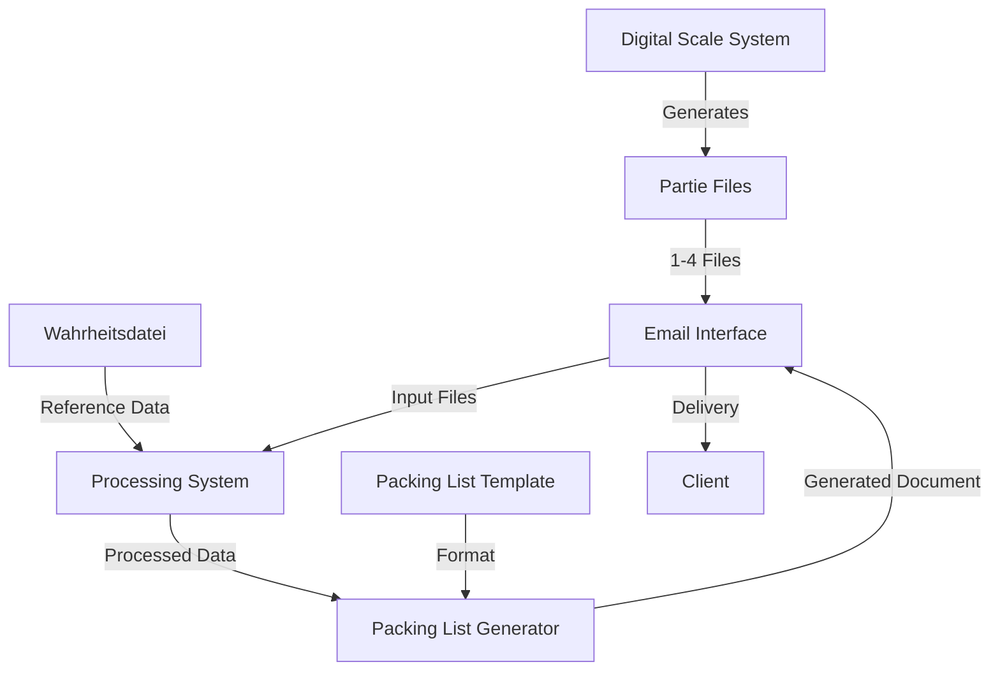
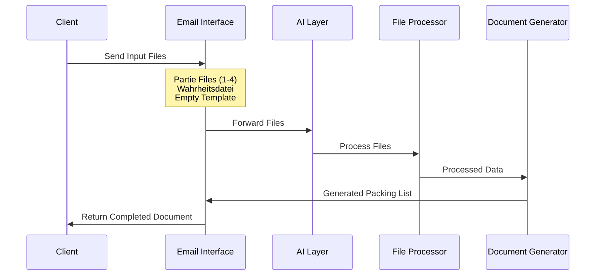

<aside>


This is the context which created the tds. SO the TDS is more important this might just help in understanding how the tds came to be

</aside>

# System Overview Analysis - Rohdex POC

## Business Context

Q: "Describe the current situation, desired outcome, and what would make this project a complete success or failure from a business perspective."

A: The current situation involves a manual process of creating Packing List documents by transferring data from multiple input sources: Partie Excel files (containing weight and quantity data from digital scales) and a Wahrheitsdatei (containing reference information). The desired outcome is to automate this process, eliminating manual data transfer and reducing errors. Success would be measured by:

1. Accurate automated generation of Packing Lists
2. Handling variable numbers of input files (1-4 Partie files)
3. Correct integration of reference data
4. Reliable email-based document exchange

Failure would be:

1. Inaccurate data transfer or calculations
2. Inability to handle variable input configurations
3. Unreliable document delivery

| Answered | Source | New Questions Generated |
| --- | --- | --- |
| YES | DesignDocRohdex-21.01.25.txt | - What is the expected volume of documents to be processed? |
|  |  | - Are there specific timing requirements for document generation? |
|  |  | - What validation steps are required in the current manual process? |

## Technical Boundaries

Q: "Walk me through how this solution will fit into your current technical landscape and what would prevent it from working effectively."

A: The solution needs to integrate with:

1. Email-based file exchange system for receiving Partie files (output from digital scales) and delivering results
2. Excel-based templates for Packing List generation
3. File processing system for data extraction and transformation

Technical constraints include:

1. Fixed format of Partie files (CSV format with specific column structure)
2. Need for accurate weight calculations and conversions (kg to lbs using 2.2046 factor)
3. Variable number of input files (1-4 Partie files per container)
4. Requirement to maintain data integrity across document transformations

| Answered | Source | New Questions Generated |
| --- | --- | --- |
| YES | DesignDocRohdex-21.01.25.txt, Partie 36223.csv | - What error handling is required for malformed input files? |
|  |  | - What validation rules should be applied to the data? |

## Open-Ended Questions Table

| Question | Answered | Source | Answer | New Questions |
| --- | --- | --- | --- | --- |
| What distinct components need to be represented in the system visualization? | YES | DesignDocRohdex-21.01.25.txt | Components identified and documented: Email Interface, AI Layer, File Processor, Document Generator, plus all required file types and client interaction | - How will components scale with future requirements? |
| How should the components be organized visually (layers, groups, hierarchy)? | YES | System Map & Sequence Diagram | Organized in logical flow: Input handling (Email) → Processing (AI/File Processing) → Output Generation (Document) | - How might this organization change with additional document types? |
| What are the direct relationships between components that need to be shown? | YES | System Map & Sequence Diagram | All relationships documented showing data flow from input reception through processing to output delivery | - What additional relationships might emerge in future phases? |

## Success Criteria

### Required Information

- Complete list of system components identified? \[Yes\]
- Visual organization structure defined? \[Yes\]
- Component grouping/layers determined? \[Yes\]

### Validation Checklist

- Each component has clear visual boundaries? \[Yes\]
- Visual hierarchy represents system structure? \[Yes\]
- Component relationships marked with correct notation? \[Yes\]

### Quality Gates

- Diagram maintains single level of abstraction? \[Yes\]
- Visual representation is clear and uncluttered? \[Yes\]
- Component naming is consistent? \[Yes\]

SUCCESS CRITERIA MET: \[Yes\]

## System Map



Component Descriptions:

1. Email Interface: Handles incoming files and outgoing documents
2. AI Layer: Interprets file contents and manages processing logic
3. File Processor: Extracts and transforms data from input files
4. Document Generator: Creates Packing List using template and processed data
5. Partie Files: CSV files containing measurement data (1-4 per container)
6. Wahrheitsdatei: Reference file with product descriptions and shipping details
7. Packing List Template: Empty template for document generation
8. Client: Sends input files and receives generated Packing List

## Important Note

Focus strictly on MVP components and relationships for POC:

- Email-based file reception
- Partie file data extraction
- Wahrheitsdatei integration
- Packing List generation
- Email-based delivery

Next Steps:

1. Gather answers to new questions generated
2. Detail data transformation specifications
3. Define exact file format requirements
4. Specify error handling procedures

Additional components and relationships will be documented separately for future phases.

## System Components and Flow

### Sequence Diagram



### File Format Specification

Partie File Structure (CSV):

```
Column structure:
1. Index
2. Date
3. Time
4. Partie Number
5. Unit Type
6. Quantity
7. Reference
8. Value1
9. Value2
10. Value3
11. Weight1
12. Weight2

```

1. Time
2. Partie Number
3. Unit Type
4. Quantity
5. Reference
6. Value1
7. Value2
8. Value3
9. Weight1
10. Weight2

```

```

# Integration Points Analysis - Rohdex POC

## Business Context

Q: "Describe the integration requirements and constraints from a business perspective."

A: For the POC phase, we will implement:

1. Email-based file exchange system using a dedicated Gmail account
2. AI system integration for intelligent data processing and validation

Integration scope includes file reception/delivery through Gmail and AI-assisted data processing through a selected AI provider (Claude/OpenAI/Deepseek).

| Answered | Source | New Questions Generated |
| --- | --- | --- |
| YES | Human Feedback | - What will be the Gmail account credentials? |
| YES | Latest Requirements | - Which AI provider will be selected? |

## Technical Boundaries

Q: "What are the technical requirements and limitations for each integration point?"

A: For POC phase, we will integrate with:

1. Email System Integration (Gmail):
    - Connect via Gmail API or third-party wrapper
    - Handle multiple file attachments
    - Support automated email reception and sending
    - Process required file formats
2. AI System Integration:
    - Connect to selected AI provider's API
    - Handle prompt/completion interactions
    - Process structured data inputs
    - Support error handling and retries

| Answered | Source | New Questions Generated |
| --- | --- | --- |
| YES | Human Feedback | - Which Gmail API approach will be used? |
| PARTIAL | Latest Requirements | - What are the AI provider's rate limits? |
|  |  | - What authentication method will be used? |

## Integration Points Details

### Email System Integration

| Access Type | Available | Details |
| --- | --- | --- |
| API Key | UNKNOWN | Need to determine email system |
| Developer Invitation Possible? | UNKNOWN | Depends on email system |
| Login Information Required? | YES | Email credentials will be needed |
| Official SDK Available? | UNKNOWN | Depends on email system |

Status: DEFERRED
Note: Gmail credentials will be added when project starts.

### AI System Integration

| Access Type | Available | Details |
| --- | --- | --- |
| API Key | UNKNOWN | Pending provider selection |
| Rate Limits | UNKNOWN | Depends on selected provider |
| Model Access | UNKNOWN | Depends on selected provider |
| Official SDK Available? | YES | All candidates provide SDKs |

Status: DEFERRED
Note: Provider selection and API details pending decision.

## Success Criteria

> Q: Okay so you are saying that we have to asnwer the other questions before we can check of the other sucess critiera checkbox/ Please judge yes or no
> 
> 
> A:”””
> 
> Judgment: Yes
> 
> Rationale: The unchecked boxes in our Success Criteria directly correspond to the technical details we're missing. We cannot meaningfully check off items like "Access methods documented", "Authentication requirements specified", or "Technical constraints documented" without first knowing the specific Gmail API implementation details I asked about.
> 
> Additional Context Needed: While we have the high-level decision to use Gmail for the POC, we cannot fully validate the success criteria until we have the technical implementation details. This is evidenced by how our current success criteria items map to our unanswered questions:
> 
> - Access methods documented ➔ Needs OAuth2/API scope details
> - Authentication requirements ➔ Needs account type/2FA decisions
> - Technical constraints ➔ Needs API limits/attachment handling details
> - File handling capabilities ➔ Needs MIME types/email format decisions
> 
> Therefore, we should keep these items unchecked until we have the technical implementation details, as they are direct dependencies for validating success.
> 
> “““
> 

### Required Information

- [x]  Integration points identified from Section 01
- [ ]  Access methods documented
- [ ]  Authentication requirements specified
- [ ]  Technical constraints documented

### Validation Checklist

- [x]  Email system integration requirements defined
- [x]  AI system integration requirements defined
- [ ]  Authentication methods determined
- [ ]  Integration limitations documented

### Quality Gates

- [x]  Integration scope matches Section 01
- [x]  Core requirements identified
- [ ]  Access details documented
- [ ]  Technical feasibility confirmed

SUCCESS CRITERIA MET: [No] - Need additional information about email system and AI provider specifics

## Important Note

For MVP/POC phase:

- Using Gmail account for simplified integration
- Selecting single AI provider for POC
- Focus on core functionality
- Validate basic workflow before scaling

## Next Steps

1. Create and configure Gmail account
2. Select AI provider and obtain API access
3. Test both integration points
4. Document any limitations
5. Gather stakeholder feedback on provider selection

# Data Flow Analysis - Rohdex POC

## Business Context

Q: "Describe what information needs to flow between systems and why from a business perspective."

A: The system needs to handle the flow of data from input files through processing to output generation:

1. Input Flow:
    - Partie files (1-4 files, containing weight/quantity data)
    - Wahrheitsdatei (containing reference information)
    - Empty Packing List template
2. Processing Flow:
    - Weight and quantity data extraction from Partie files (Column K for weights, Column J/I for tare)
    - Reference data integration from Wahrheitsdatei (product descriptions, container numbers)
    - Data transformation (kg to lbs using factor 2.2046)
3. Output Flow:
    - Generated Packing List document with all calculations
    - Return delivery to sender

Key Constants:

- Destination is always Los Angeles for this client
- Partie files come from industrial scale system in fixed format
- Each container can have 1-4 different types of down/feathers

| Answered | Source | New Questions Generated |
| --- | --- | --- |
| YES | Section 01, Design Doc, Kickoff Transcript | - What is the expected format of the generated Packing List? |
|  |  | - Are there any required data validations during flow? |

## Open-Ended Questions Table

| Question | Answered | Source | Answer | New Questions |
| --- | --- | --- | --- | --- |
| What triggers the overall process? | YES | Section 02 | Receipt of email with required input files (Partie files, Wahrheitsdatei, template) | - How are incomplete submissions handled? |
| What information must move between systems? | PARTIAL | Section 01 | Input: Partie files (weights, quantities), Wahrheitsdatei (reference data), Template. Output: Completed Packing List | - What specific data points are extracted from each file? |
| Where must information end up? | YES | Section 01, 02 | Final Packing List document delivered back to sender via email | - Are there any required interim storage points? |

## Information Requirements

### Process Start

- Trigger: Email received containing required input files
- Initial System: Gmail Interface (POC)
- Required Files:
    - 1-4 Partie files (CSV format)
    - Wahrheitsdatei (reference data)
    - Empty Packing List template

### Required Information Movement

From Email Interface to Processing System:

- Must Send:
    - All received input files
    - Sender information for reply
- Must Achieve:
    - Successful file extraction
    - Validation of required files present

From Processing System to Document Generator:

- Must Send:
    - Extracted weight/quantity data
    - Reference information
    - Template structure
- Must Achieve:
    - Accurate data transformation
    - Proper data placement in template

From Document Generator to Email Interface:

- Must Send:
    - Completed Packing List document
- Must Achieve:
    - Successful delivery to original sender
    - Maintained data accuracy

### End State

- Final Location: Client's email inbox
- Required State:
    - Complete Packing List document
    - All required data accurately transferred
    - Proper format maintained

## Success Criteria

- [x]  Clear trigger event identified (email receipt)
- [x]  Required information movement documented
- [x]  Final state requirements defined

## Important Note

Focus on MVP/POC requirements:

- Track data flow through Gmail-based system
- Ensure accurate data transformation
- Maintain file format integrity
- Verify complete information transfer

## Next Steps

1. Define specific data extraction points
2. Document transformation rules
3. Establish validation requirements
4. Create data flow test cases

# Data Structures Analysis - Rohdex POC

## Business Context

Q: "What are the essential data structures and formats needed for the system to function?"

A: The system needs to handle three types of input files and one output file format:

Input Formats:

1. Partie Files (CSV):
    - Fixed format from industrial scale system
    - Contains weight and quantity data
    - 1-4 files per container
2. Wahrheitsdatei (Excel):
    - Reference information in V-LIEF tab
    - Contains product descriptions and container details
    - One file per container
3. Empty Packing List Template (Excel):
    - Pre-formatted template
    - Contains calculation formulas
    - One template per container

Output Format:

- Completed Packing List (Excel)
- Maintains template structure
- Contains all calculations and transformations

| Answered | Source | New Questions Generated |
| --- | --- | --- |
| YES | Section 01-03, Design Doc, File Examples | - Are there any special character handling requirements? |

## Open-Ended Questions Table

| Question | Answered | Source | Answer | New Questions |
| --- | --- | --- | --- | --- |
| What are the essential input data formats needed for system operation? | YES | Kickoff Transcript, File Examples | Partie: CSV with fixed columns (K for weights, J/I for tare), Wahrheitsdatei: Excel with V-LIEF tab, Template: Excel with formulas | - Are there format variations to handle? |
| What are the required output data formats that the system must produce? | YES | Packing List Example | Excel format maintaining template structure with calculated weights, descriptions, and container info | - Are there any specific Excel version requirements? |
| What are the core fields required for each data structure? | PARTIAL | File Examples | See Core Fields section below | - Are all field mappings confirmed? |

## Core Fields

### Partie File (CSV)

Essential Fields:

- Index (Column A)
- Date (Column B)
- Time (Column C)
- Partie Number (Column D)
- Quantity (Column F)
- Weight (Column K)
- Tare (Column J/I)

### Wahrheitsdatei (Excel)

Essential Fields in V-LIEF tab:

- Partie Numbers
- Product Descriptions
- Container Numbers
- Destination (constant: Los Angeles)

### Packing List Template (Excel)

Required Sections:

- Invoice Number
- Container Number
- Product Description sections
- Bundle calculations:
    - Gross weight (kg)
    - Tare weight (kg)
    - Net weight (kg)
    - Conversion factor (2.2046)
    - Weight in lbs

## Success Criteria

### Required Information

- [x]  Core input formats defined
- [x]  Essential output formats defined
- [x]  Required fields identified for each format

### Validation Checklist

- [x]  Field types specified
- [x]  Field constraints documented
- [x]  Required vs optional fields marked

### Quality Gates

- [x]  Only MVP fields included
- [x]  Data formats are standardized
- [x]  Field names are consistent

SUCCESS CRITERIA MET: \[Yes\]

## Important Note

For MVP/POC:

- Focus on essential fields only
- Maintain existing file formats
- Use standard data types
- Follow existing naming conventions

## Next Steps

1. Verify field mappings between formats
2. Document any field transformations
3. Validate calculation formulas
4. Test with sample data

# Dependencies Analysis - Rohdex POC

## Business Context

Q: "What external dependencies and system requirements are needed for the POC to function?"

A: The POC needs to handle three main areas of functionality:

1. Email Integration (Gmail)
2. File Processing (CSV/Excel)
3. Data Transformation

Each area requires specific dependencies while keeping the overall system requirements minimal for the POC phase.

| Answered | Source | New Questions Generated |
| --- | --- | --- |
| YES | Section 01-04 | - What are the performance requirements for file processing? |

## Open-Ended Questions Table

| Question | Answered | Source | Answer | New Questions |
| --- | --- | --- | --- | --- |
| What core frameworks or libraries are required? | YES | Previous Sections | 1. Gmail API/SDK for email handling 2. CSV/Excel processing library 3. Basic calculation utilities | - Are there preferred libraries for Excel handling? |
| What are the minimum version requirements for each dependency? | PARTIAL | Section 02 | Gmail API version requirements to be determined based on chosen implementation approach (raw vs third-party) | - What Excel format versions need to be supported? |
| What system-level requirements must be in place? | YES | Section 02 | Basic email server access, ability to handle file attachments, support for Excel/CSV processing | - Are there any memory/processing constraints? |

## Core Dependencies

### Email Handling (Gmail)

Required Capabilities:

- Email reception and sending
- Attachment handling
- Basic authentication
- Reply functionality

### File Processing

Required Capabilities:

- CSV reading (Partie files)
- Excel reading (Wahrheitsdatei)
- Excel writing (Packing List)
- Basic formula handling

### Data Transformation

Required Capabilities:

- Basic mathematical operations
- Unit conversion (kg to lbs)
- Data mapping between formats
- String handling

## Success Criteria

### Required Information

- [x]  Core framework requirements identified
- [x]  Essential library dependencies listed
- [x]  System requirements documented

### Validation Checklist

- [ ]  Version compatibility verified (pending Gmail API choice)
- [x]  Direct dependencies confirmed
- [x]  System requirements are feasible

### Quality Gates

- [x]  Dependencies are minimal for MVP
- [x]  No conflicting requirements
- [ ]  All dependencies are available (pending Gmail API setup)

SUCCESS CRITERIA MET: \[PARTIAL\] - Pending Gmail API implementation details

## Important Note

For POC phase:

- Use standard, well-supported libraries
- Minimize external dependencies
- Focus on Gmail API integration
- Keep file processing simple
- Avoid complex framework requirements

## Next Steps

1. Determine specific Gmail API approach
2. Select Excel/CSV processing library
3. Verify version compatibilities
4. Test basic functionality with chosen libraries