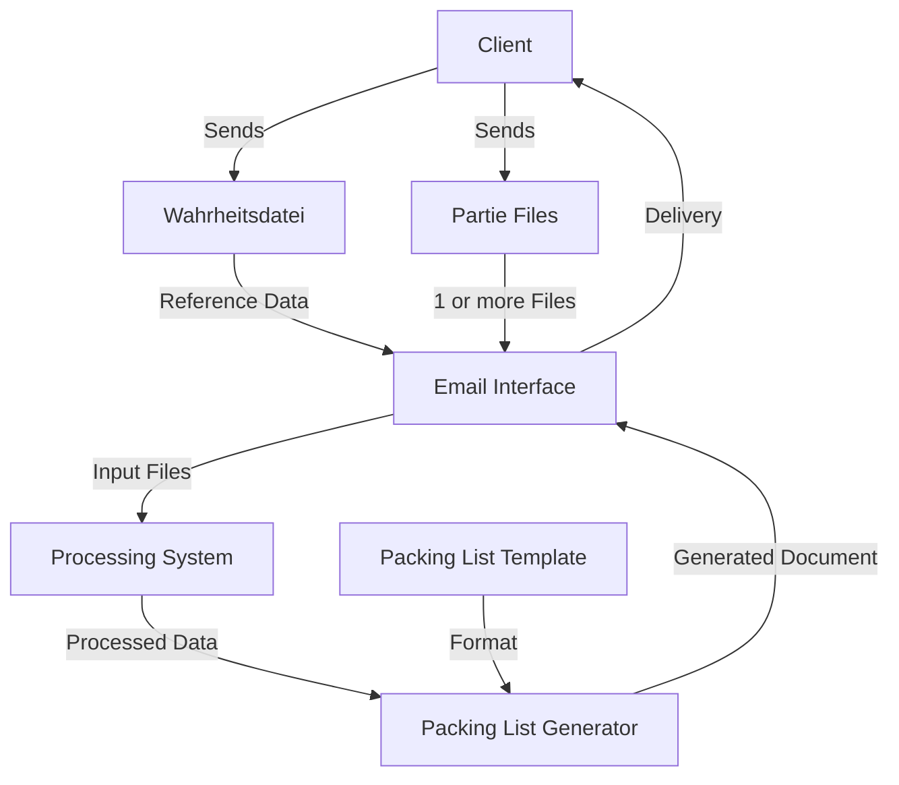
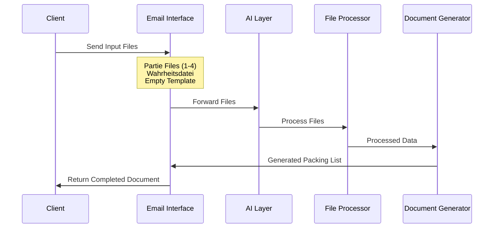

# Technical Design Specification - Rohdex POC

## Document Information

- Project: Rohdex POC
- Version: 1.0
- Date: 2024-02-21
- Status: Draft - POC Phase

## Term Dictionary

### Core Terms

- Partie File: CSV format file generated by industrial scale system containing weight measurements
- Wahrheitsdatei: Excel reference file containing product descriptions and container details
- Packing List: Final Excel document generated by the system combining Partie and reference data from “Wahrheitsdatei”
- Bundle: Individual package of down/feathers with specific weight measurements
- Tare: Weight of packaging material, measured in kilograms
- Gross Weight: Total weight including product and packaging, measured in kilograms
- Net Weight: Weight of product only (Gross Weight minus Tare), measured in kilograms
- AI Provider: External service (Claude/OpenAI/Deepseek) providing natural language processing capabilities
- AI Model: Large language model used for data processing and validation
- API Key: Authentication token for accessing AI provider's services

### System Components

- Email Interface: Gmail-based system component handling file reception and delivery
- AI Layer: Processing component that interprets file contents and manages transformation logic
- File Processor: Component that extracts and validates data from input files
- Document Generator: Component that creates final Packing List using template and processed data

## Executive Summary

This technical design specification outlines the implementation of an automated system for generating Packing List documents from Partie files and reference data. The system will handle email-based file exchange, data processing, and document generation for the POC phase.

## 1. System Overview

### 1.1 Business Context

The system automates the creation of Packing List documents by processing:

- 1-4 Partie files (digital scale data in CSV format)
- One Wahrheitsdatei (reference information in Excel format)
- One Empty Packing List template (Excel format)

Success criteria:

1. 100% accuracy in Packing List generation
2. Processing of 1 or more Partie files per container
3. Complete reference data integration from Wahrheitsdatei
4. Reliable email-based document exchange

### 1.2 System Architecture

### 1.3 Component Descriptions

1. Email Interface: Gmail-based component that:
    - Receives input files via email
    - Validates file attachments
    - Sends generated documents
    - Maintains sender context
2. AI Layer: Processing component that:
    - Validates file formats
    - Extracts required data
    - Applies business rules
    - Manages data transformation
3. File Processor: Data handling component that:
    - Reads CSV and Excel files
    - Validates data integrity
    - Extracts weight measurements
    - Maps data relationships
4. Document Generator: Output component that:
    - Applies template formatting
    - Performs weight calculations
    - Generates Excel output
    - Validates final document

## 2. Integration Points

### 2.1 Email System Integration (Gmail)

Implementation Requirements:

- Gmail API/SDK integration
- MIME type handling for attachments

Required Capabilities:

- Automated email reception and response
- Multiple attachment handling
- File format validation

### AI System

Implementation Requirements:

- AI provider API integration
- API key authentication
- Error handling and retries
- Rate limit management

Required Capabilities:

- Natural language processing
- Data validation and extraction
- Structured output generation
- Error recovery

### 2.2 Process Flow

## 3. Data Structures

### 3.1 Input Formats

### Partie Files (Excel)

Required Fields:

- Index (Column A): Sequential number
- Date (Column B): Date format
- Time (Column C): Time format
- Partie Number (Column D): Unique identifier
- Quantity (Column F): Integer value
- Weight (Column K): Weight measurement
- Tare (Column J/I): Packaging weight

### Wahrheitsdatei (Excel)

Required Fields in V-LIEF tab:

- Partie Numbers: Must match Partie file identifiers
- Product Descriptions: Text descriptions of down/feather types
- Container Numbers: Unique container identifiers
- Destination: Always "Los Angeles" for this client

### 3.2 Output Format

### Packing List Template (Excel)

Required Sections with Specifications:

- Invoice Number: Format YYYYMMDD
- Container Number: Alphanumeric identifier
- Product Description: Exact match from Wahrheitsdatei
- Bundle calculations:
    - Gross weight: Kilograms with 2 decimal places
    - Tare weight: Kilograms with 2 decimal places
    - Net weight: Kilograms with 2 decimal places
    - Conversion factor: Exactly 2.2046
    - Weight in lbs: Calculated with 2 decimal places

## 4. Dependencies

### 4.1 Core Dependencies

1. Email Handling Requirements:
    - Gmail API v1.0 or higher
    - OAuth 2.0 authentication library
    - MIME type processing library
    - UTF-8 encoding support
2. File Processing Requirements:
    - CSV parser supporting UTF-8
    - Excel reader supporting .xlsx format
    - Excel writer supporting formulas
    - Data validation library
3. Data Transformation Requirements:
    - Decimal precision handling
    - Unit conversion functions
    - String manipulation library
    - Data mapping framework
4. AI Processing Requirements:
    - AI provider SDK/library
    - API authentication handling
    - Response processing utilities
    - Rate limiting management

### 4.2 System Requirements

Minimum Specifications:

- Gmail account with API access enabled
- AI provider API access
- Excel/CSV processing capabilities
- File attachment support
- Network connectivity

## 5. Implementation Notes

### 5.1 MVP Focus Areas

Implementation Priorities:

1. Email Integration:
    - Gmail API setup and configuration
    - Authentication implementation
    - File handling setup
2. File Processing:
    - Excel file parsing implementation
    - Data validation setup
    - Format handling
3. Document Generation:
    - Template integration
    - Calculation implementation
    - Output validation

### 5.2 Constants

System Constants:

- Destination: "Los Angeles" (confirmed client location)
- Weight Conversion: 2.2046 (standard conversion factor)
- File Formats:
    - Partie: Excel format from digital scale
    - Wahrheitsdatei: Excel .xlsx
    - Template: Excel .xlsx
- Container Capacity: 1-4 product types

## 6. Open Items and Gaps

### 6.1 Integration Points Gaps

Implementation Decisions Required:

- Gmail API authentication method selection
- API version specification
- Rate limit requirements
- AI provider selection
- AI model version requirements

### 6.2 Dependencies Gaps

Version Specifications Needed:

- Gmail API version selection
- Excel library version selection
- CSV parser version selection
- AI provider SDK version
- AI model version

### 6.3 Technical Questions

Performance Requirements:

- File processing time limits
- Memory usage thresholds
- Network bandwidth requirements
- Error retry limits

### 6.4 Format Questions

Data Handling Specifications:

- Character encoding requirements
- Excel version compatibility range
- CSV dialect specifications

---

Note to Marius: The gaps listed in section 6 require decisions before development but won't block initial setup. Prioritize Gmail API decisions in Week 1.touch